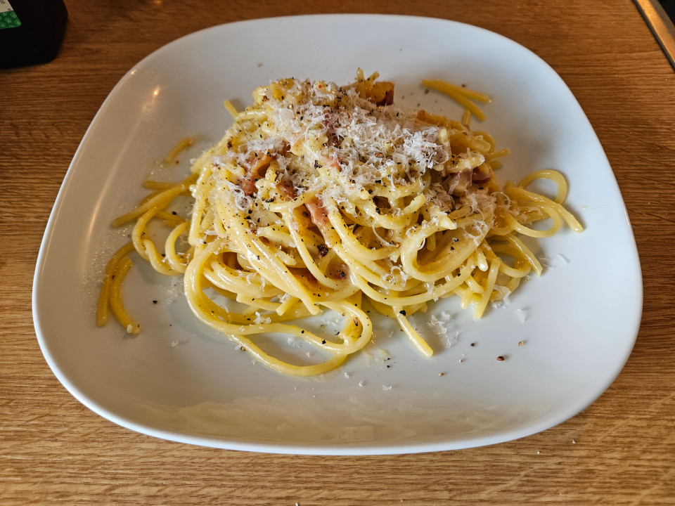
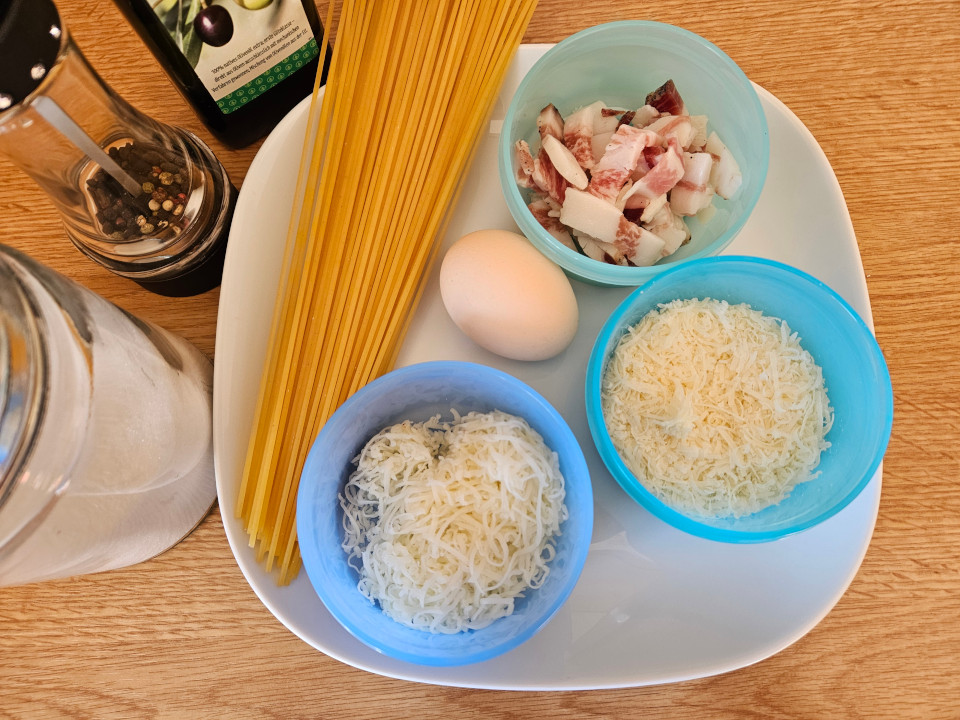
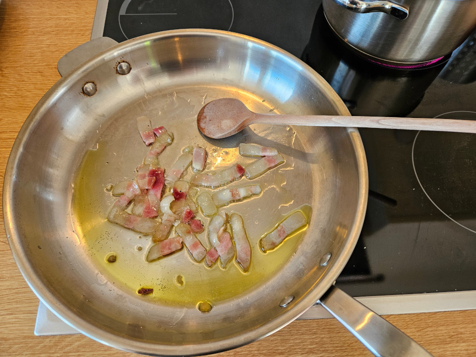
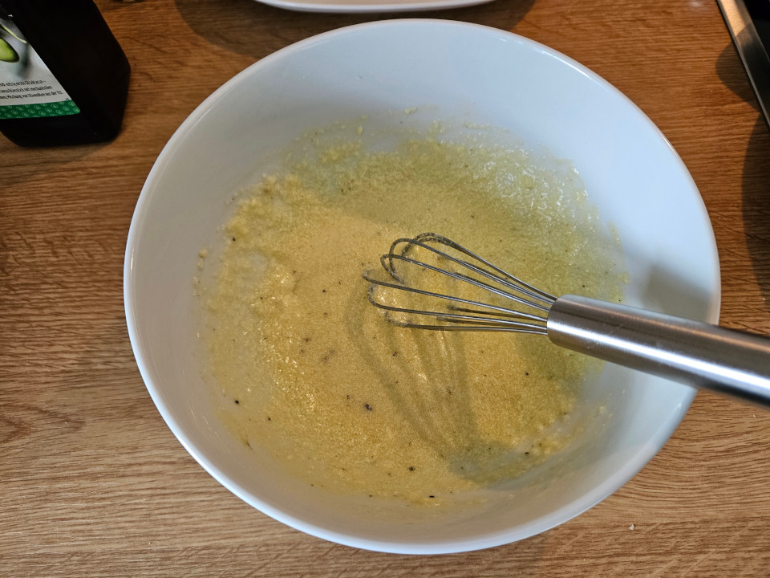
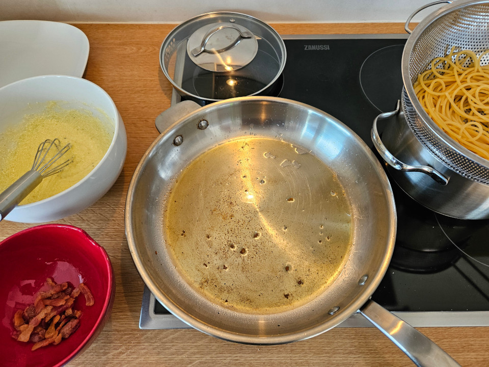

# Carbonara

Simple, but delicious classic.

## Ingredients
per persion/portion:
- 120g Pasta
- 50g Guanciale
- 1 Egg
- 25g Pecorino
- 25g Grana Padano
- Olive Oil
- Salt
- Pepper

## Instructions

Prepare the ingredients:
- Cut the Guanciale into (not too small!) pieces
- Grate the cheese

Begin by browning the the Guanciale in a pan with some olive oil. Afterwards put it aside to rest.
Now cook your pasta; Time depends on the type you use, but you want to slightly undercook it, because it will be finished in the pan.
While the pasta is cooking crack the egg and whisk it together with the cheese and a pinch of salt and some black pepper. Some minor lumpyness is fine, but overall you should aim for something 'reasonably well combined', so whisk like your live depends on it!
Once the pasta is 'done' (but undercooked) strain it, but make sure to safe some of the pasta water.
Get the Guanciale back into the pan and add a ladle of the pasta water. Bring to a light boil.
Once the pasta water starts boiling immediately lower the heat again and add the strained pasta.
Toss/Stir for a short while (we are talking seconds, rather than minutes) and then add the egg mixture.
Now heavily stir everything so that the egg mixture, together with the pasta water and the oil/fat form a creamy sauce and adhere to the psta. Btw, this process is called Mantecare.
Transfer to a plate and add some freshly ground black pepper and a little bit of extra grated cheese on top.

## Pairing
- White whine (e.g.: Frascati Superiore).

## Notes
- As with lots of Italian dishes you neither have a ton of ingredients or intricate process to deal with. However try to use some 'slightly better' ingredients; It is all about celebrating the quality of the goods that go into the dish, rather than process or spices.
- For pasta I usally go with Spaghettoni, but that is down to personal preference. You can also just go with Spaghetti or even Bucatini.
- When it comes to cheese there are quite a few variations. Some people only use Pecorini, others use Parmigiano Reggiano instead of Grana Padano. Here once again my choices are down to personal preference; Try some different mixes and pick what you like best.
- Guanciale is a bit difficult to find here, but I found that bacon as a substitute doesn't taste nearly as good. I suggest a longer search until you find Guanciale instead of opting for something different.
- As you can see in the pictures I use quite a bit of oil. When using less oil the sauce tends to not come together as easily. Similarly I had quite bad results when trying to make it in a non-stick pan instead of a steel pan; Both things might just be a skill issues though.

## Images

