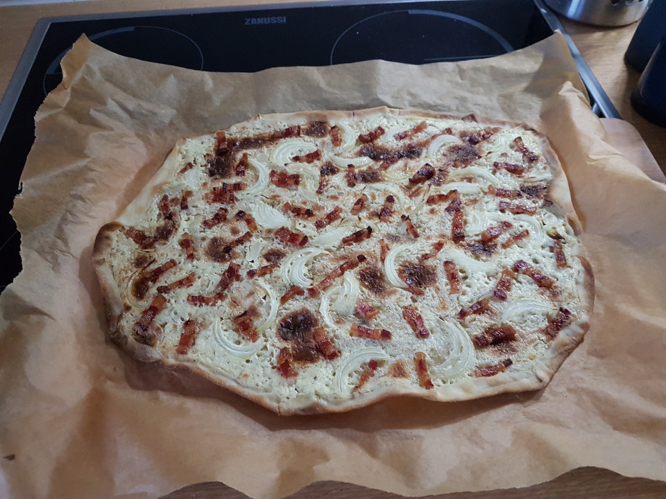
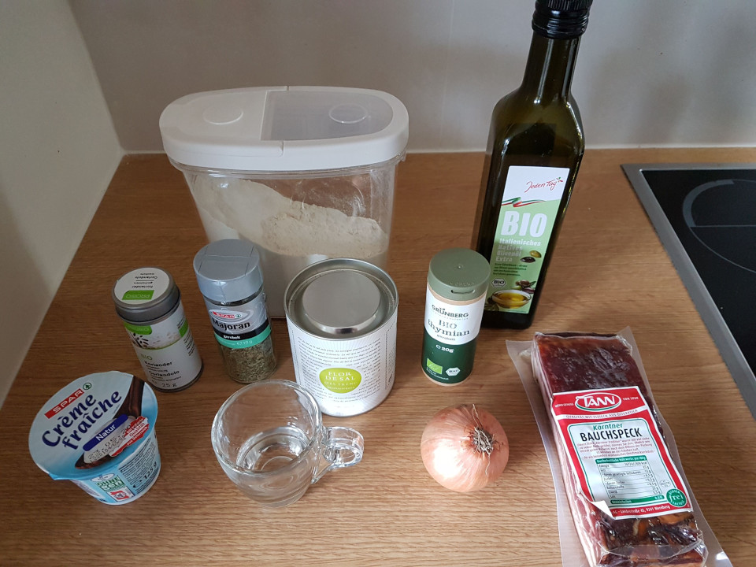
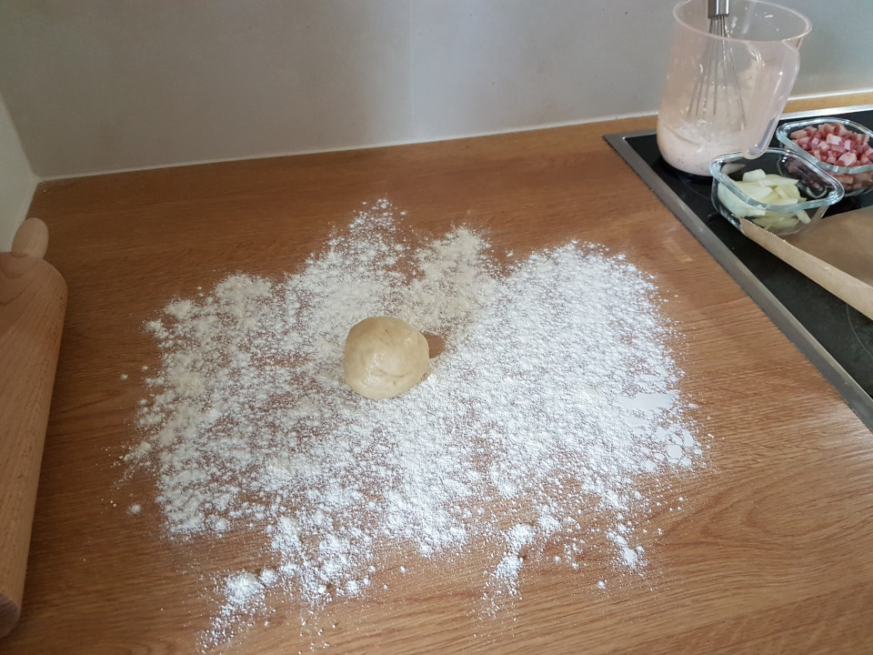
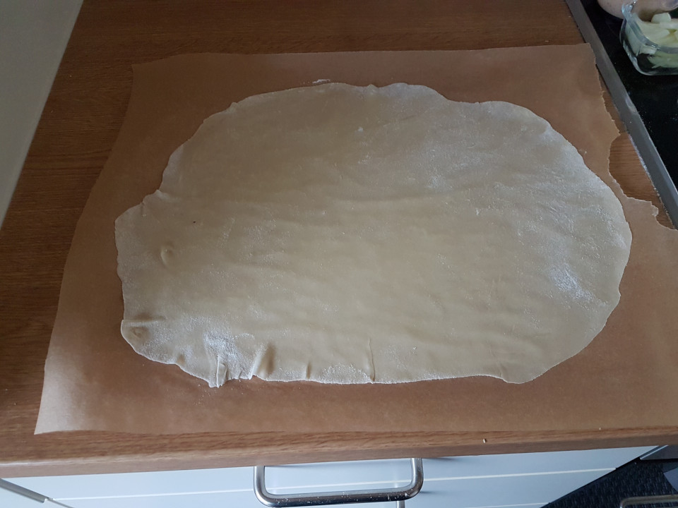
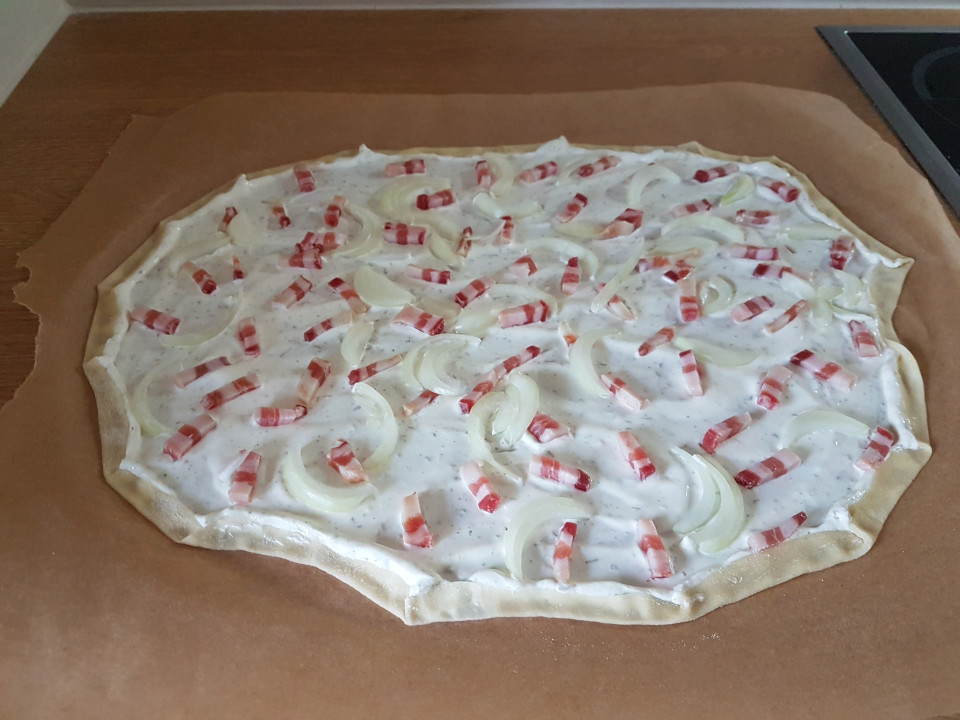

# Flammkuchen - aka Flammekueche aka Tarte Flambée or 'Flame Cake'

Slightly ridiculous name, but quick and easy to make and quite delicious!

## Ingredients
Dough:
- Flour (all purpose): 60g / ~2oz
- Water (warm): 30g / ~1oz
- Pinch of Salt
- Tablespoon of olive oil
Topping:
- Crème frâiche: small tub (120g)
- Herbs (whichever you like; I use: majoram, thyme, dried cilantro, lttle bit of black pepper, flor de sal)
- Half an onion
- Lardon (~100g)

## Instructions

Before you start: Pre-heat oven; Convection; As hot as possible; Baking tray inside.

Combine the dough ingredients in a bowl until it holds together. Toss onto floured surface and knead for ~5 min, until everything is combine, holds together and is reasonable smooth and workable.
Form a ball and let rest in the fridge; for at-least 15 minutes. Use the time to prepare the rest.

Mix herbs, créme frâiche and a small amount of water; Just enough to make it 'spreadable'.
Cut onion and lardon in strips; Relatively thin and at 1 to 2 inches in length.

Flour a surface and roll the dough out; 'Paper thin' (~ 1 or 2 mm? If you can see the pattern of your counter top it is almost thin enough ;-)). Carefully transfer the dough onto baking paper.
Spread crème frâiche on top and spread onions and lardon on it. Pretty much as if you were coverin a pizza.
Optional: fold over the outer most inch of the dough.
Get hot baking tray out of the oven and transfer your flammkuchen to it. I usually hold the tray close to my counter top and slide it onto it.
Bake on lowest position until it starts to darken in some spots; Should take between 5 and 10 minutes.

## Pairing
- White whine (e.g.: Riesling) or a subtle wheat beer (for example: Edelweiß Hefetrüb) work well enough.
- In fall, try to find some 'Federweißer'(/Fiederwäissen/Weißer Sturm/Vino Nuovo/Vin Bourru); That stuff is perfect for it . . . Well, it is perfect in general!

## Variations
The secret of Flammkuchen is, that it is just a simple vehicle for cream and pork. However flammkuchen can be your canvas for pretty much anything!
Wanna try a different take on apple pie? Instead of herbs, put a bit of cinnamon and honey into the créme frâiche and top with apple slices instead of onion and lardon.
You prefer fish over meat? Replace the lardon with salmon and maybe add some leafy greens.
Dead animals in your meal aren't your thing? Try some of your favourite veggies.
A bit like pizza, the sky is the limit. Heck, you can even make a 'sweet tooth version' with nutella, maple syrup and banana.

## Notes
- For the 'real deal', it should be made in a wood burning oven. So if you have a wood burning pizza oven at home, use that! But you will have to figure out the baking time etc yourself.
- There are more complex versions of the dough with small amounts of yeats (some even using beer to supply that) and more resting time, but getting the amounts right is a bit fiddly. So while not super traditional, this is the no-fuss home version of the recipe.
- Typically you would use 'Schamnd' rather than créme frâiche; The slightly-lower-fat cousin of crème frâiche. But more fat means more taste, and créme frâiche is easier to find (at-least here).
- Restaurant versions generally have less stuff on top (the topping amount of this recipe would be strechted to cover at-least 2 or 3 flammkuchen).
- Folding the outside of the dough is as non-traditional as it gets; But with a home oven the thing tends to burn on the outside when you don't fold it.

## Images

