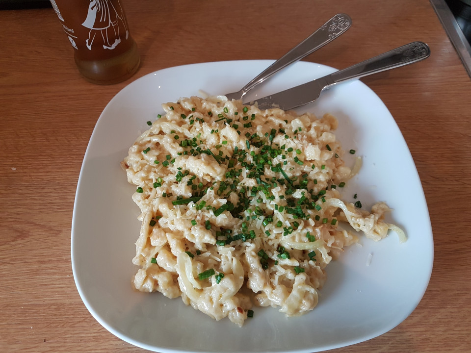
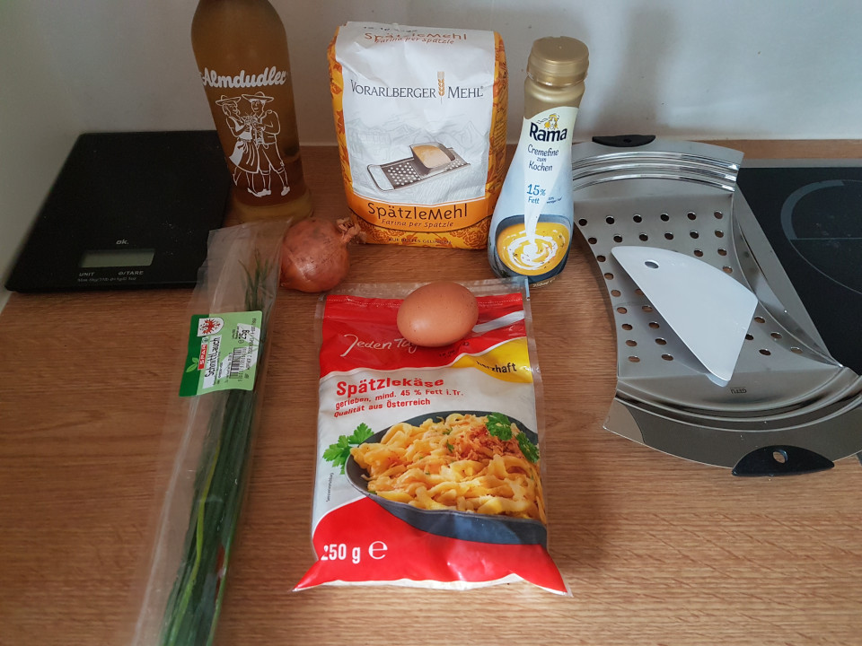
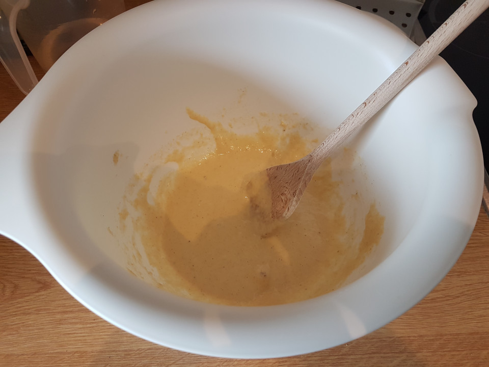
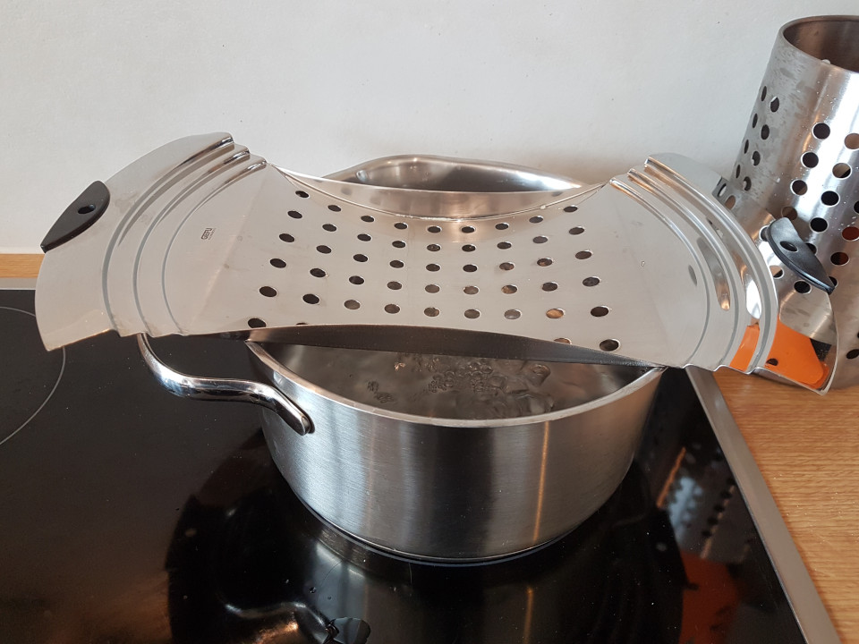
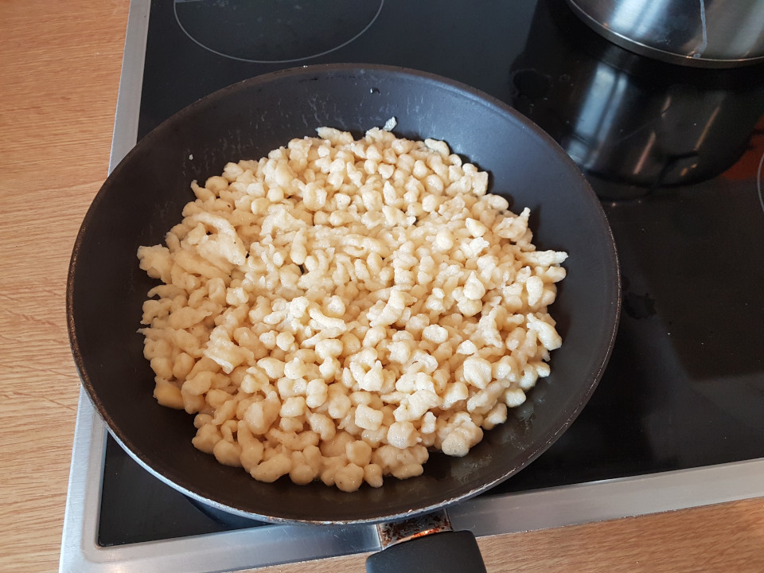
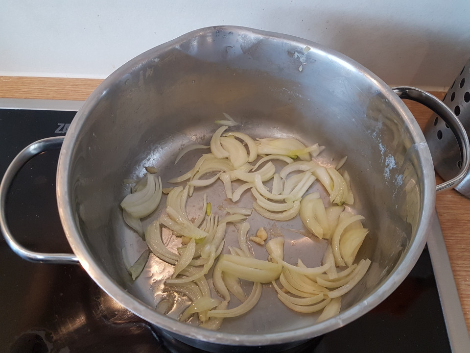
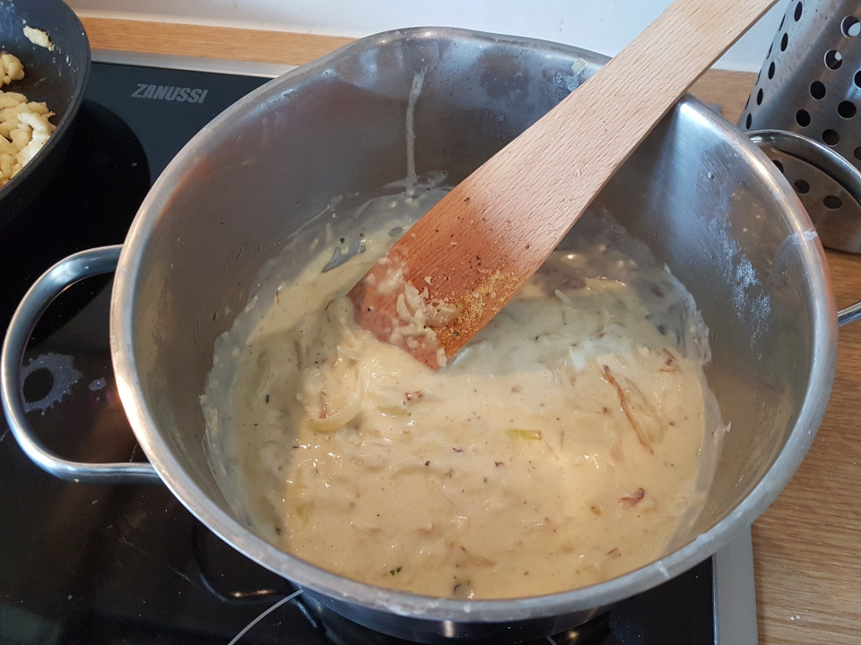

# Käsespätzle - The German answer to Mac&Cheese.

Super simple recipe; And once you know how to make Spätzle you have one of the best German side dishes in your repertoire; Something that also works perfectly with Goulash or [some dhal-like lentil sauce](linsen_und_spaetzle.md).

## Ingredients
Spätzle:
- Flour*: 100g ~ ½ cup
- Eggs: 1
- Water: ¯\\\_(ツ)_/¯
- A pinch of nutmeg

*There is spexifix Spätzle flour, which is somewhat close to 'spelt'. But all purpose flour should also work fine.

**Käse**spätzle part:
- Tiny bit of olive oil
- 1 Small to medium onion (per person/portion)
- Cream: 75-100ml ~ < ½ cup
- Vegetable stock. Powder, small amount
- Cheese**: A few hand full (seriously never measure that)

**You can get a Käsespätzle-cheese-mix here; that is equal parts Emmental, Gouda and 'mountain cheese', but going full-Gouda should be perfectly fine.

## Instructions

Spätzle:

Mix the flour, eggs, nutmeg and water in a bowl until you have a smooth batter; Adding the water little by little. You are looking for a consistency that is a bit thicker than pancackes; Maybe a wee bit thinner than cake batter.
We are going to press the batter through 'something with holes', usually a Spätzlesieb (see photos, the metal thingie), but a colander should also work.
Once the batter is done let it rest and get a pot with water to a boil. When the bater is boiling hold your colander over the water, ladle some batter in and press it through, using the back of the ladle.
The batter should sink down, boil (and firm up a bit) and raise to the water surface when done; Should take no more than a minute or two. You can use a skimmer to fish out the Spätzle and transfer them to a bowl to make room for more.
Repeat the whole process until all the Spätzle are boiled.
I usually fry the Spätzle off in some butter for 5 to 10 minutes until they are starting to get golden brown and crispy (in some parts). You can get that whole frying off thing going while you do the next step.

Käsespätzle:
Empty the water from the pot from before and get some olive oil (about a table spoon) in there and sautee off the onions. Afterwards get in the cream, add the vegetable stock powder and some black pepper. Add the cheese and wait until it is melted. Remember to stir every now and then.
Once the cheese is melted get your awesome homemade Spätzle and toss them in there.
Plate everything and add some chives for taste + a tiny bit of color.

## Pairing
Almost anything is fine. Usual options would be:
- Jagergee: Black tea with (Stroh-)Rum. Very much a winter-months (and apres ski partying) kind of thing.
- A wheat beer: I suggest Edelweiss Hefetrüb. The somewhat boring choice.
- Almdudler: herbal lemonade. My usual choice (takes me back to my teenage years, when I had that stuff in cottage restaurants)

## Notes
One downside of the this recipe is the cleaning up afterwards . . . batter and cheese remains -_-.

## Images

