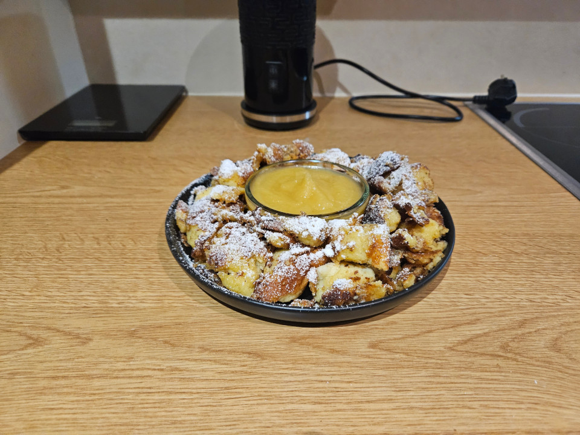
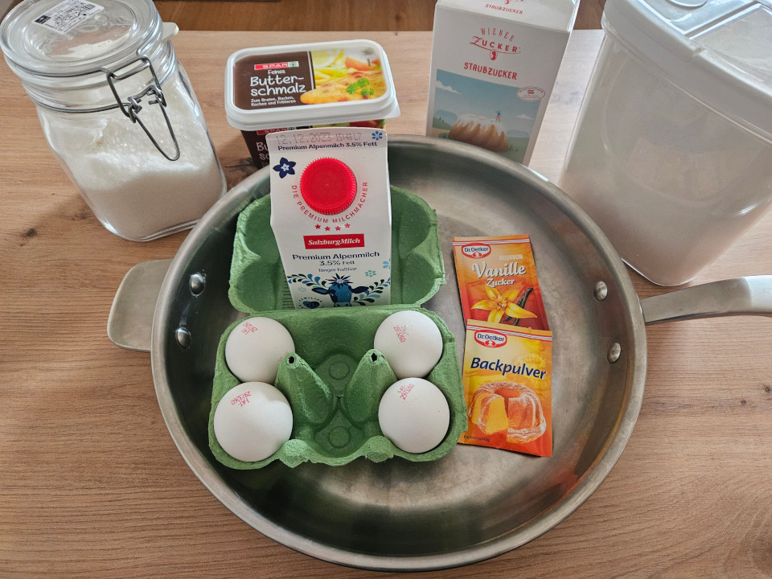
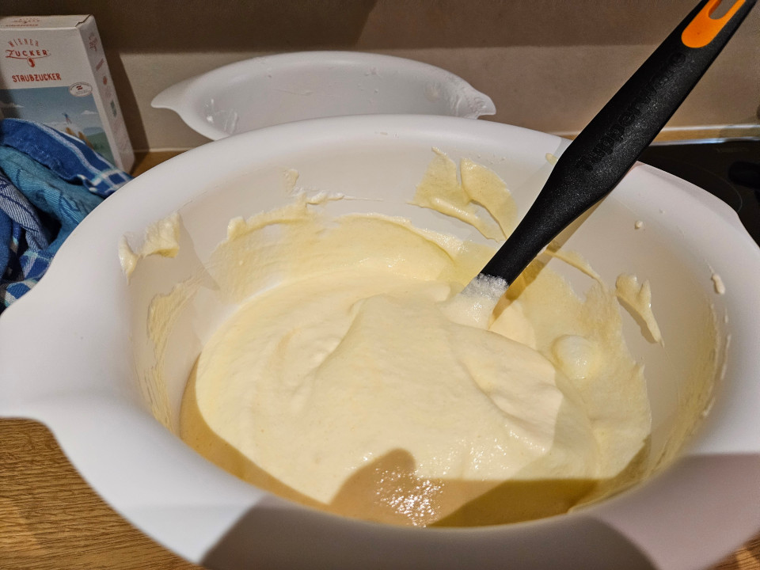
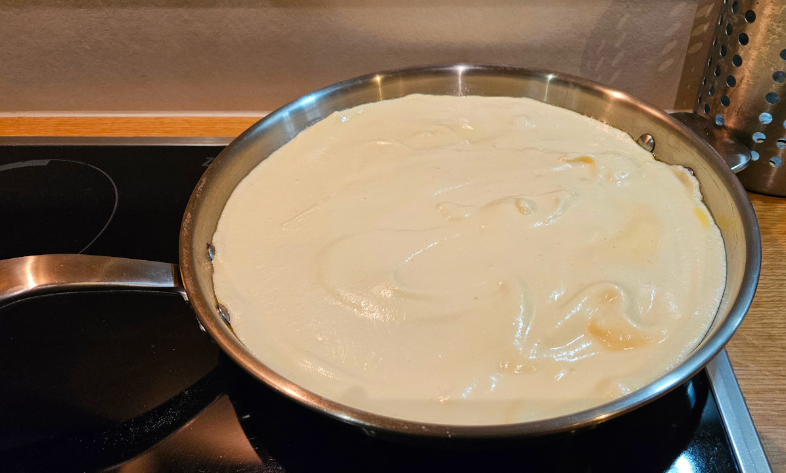
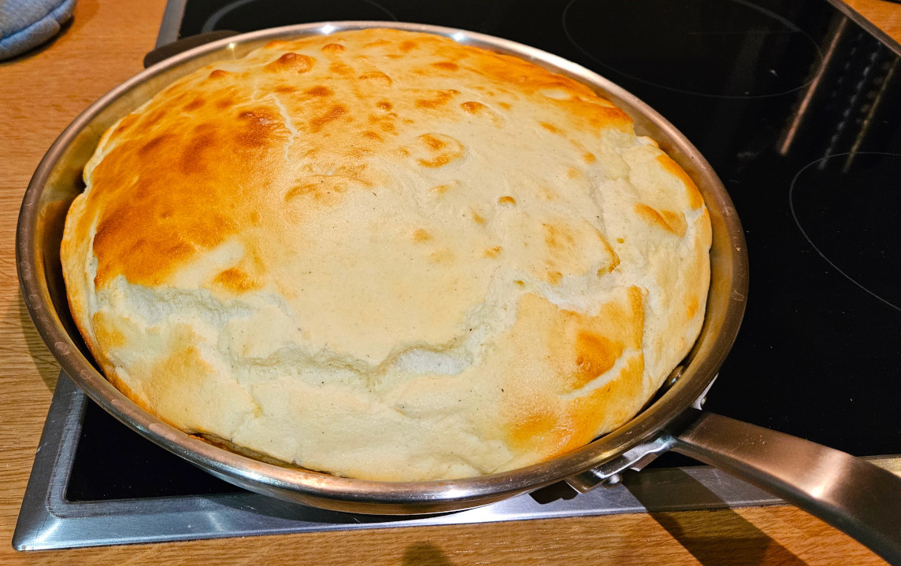
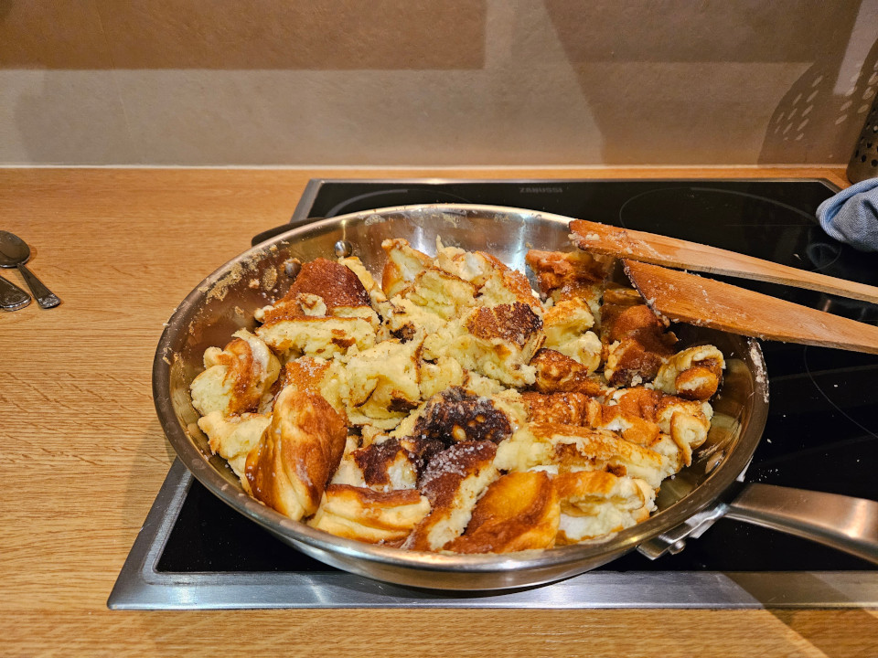

# Kaiserschmarrn - The ~~King~~ Emporer of Pancakes

The given recipe can either serve as one full meal or two desserts.

## Ingredients
- **200g** (~7oz) all-purpose **flour**
- **4 eggs**
- **400 ml** (~13½ fl oz) **milk**
- **1 pkg vanilla sugar**
- **1 pkg baking powder**
- **2-3 tbsp** granulated **sugar**
- pinch of **salt**
- **1-2 tbsp clarified butter**
- **powdered sugar**
- **apple sauce**

## Instructions
Separate the eggs and mix the egg yolks with the flour, vanilla sugar, milk, baking powder and 1 tbsp of sugar to a batter. You have made pancakes before, this is pretty much the same, though the batter should be a bit more liquid than your average american pancake.
Put the batter aside and already pre-heat the oven (180°C ~ 356°F, convection). Also start heating the pan (medium heat) and toss the clarified butter in there.
Now on to the egg whites. Add a pinch of salt and 1 tbsp of sugar. Beat the living crap out of the egg whites (stiff peaks).
Carefully lift the batter under the beaten egg whites.
Fill the final batter into the pan an let it cook for ~3 minutes. We want to get some color on the underside.
Next we put the pan with the batter into the oven for ~10 minutes. Until we see some amount of browning on top.
Get the pan out of the oven and back on the hob. Slice the risen pancake in 4 and flip the pieces (usually the underside is quite a bit darker at this point, so we want to brown the lighter side a bit more).
After a short while grab 2 forks (or wooden spatulas) and rip the batter apart. Add the last tbsp of sugar and let it caramelize and make sure the the thing is cooked through.
Once it is cooked through and nicely browned it can be served with some apple sauce and topped with a bit of powdered sugar. Enjoy!

## Notes
Losing my 'stria cred here as this recipe diverges from the traditional recipe:
* **Butter**: Usually recipes call for normal butter instead of clarified butter, but that browns (and burns) too easily; Therefore I go for the more idiot-friendly option of clarified butter.
* **Baking Powder**: If anybody around here hears of me making my Kaiserschmarrn with baking powder I will probably be exiled from Austria . . . but it is the easiest way to get it reliably fluffy.
* **Raisins**: Traditional recipes tell you to add raisins before throwing the batter into the oven, but I prefer my Kaiserschmarrn plain.
* **Sauce**: It should be served with plum sauce (Zwetschgenröster), but I prefer it with apple sauce; And these days most restaurants also opt for apple sauce instead of plum sauce.

## Background
Legend has it that Sisi (Empress Elisabeth of Austria) was a bit of a picky eater. One day the royal patissier decided to surprise her with a light fluffy 'omlette-like-thingie', which she didn't like. Franz (Emporer Franz Joseph I.) was also present and supposedly said: 'Na dann gib mir halt mal den Schmarrn her, den unser Leopold da wieder z´amkocht hat.' - well then, give me the stuff that our Leopold cooked up again.
And since then it is called Kaiserschmarrn - emporer's stuff.
Very Austrian in origin, but today it is quite present in the entire DACH region (Germany, Austria, Switzerland, Liechenstein). Can be a smaller portion as a dessert, but more often than not it is a full meal on its own. Imho the perfect apres ski food, to regain some energy.

## Images

