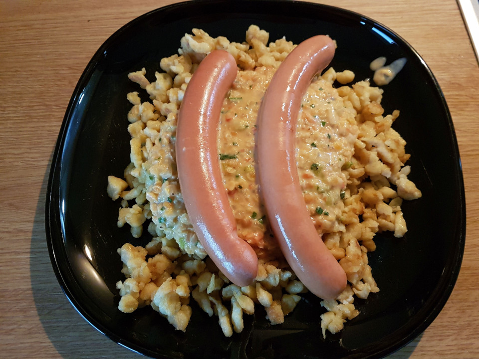

# Linsen und Spätzle - Spätzle with a hint of India

Kind of a follow up to the [Käsespätzle](kaesespaetzle.md) recipe - as in: it is another dish revolving around Spätzle.

For the Spätzle, just refer to the other recipe (or get some 'ready made' Spätzle from a supermarket, if you can find em).

## Ingredients
- Butter: 3 table spoons
- Onion: 1 large
- Garlic: 1 clove
- Leek: 1/3
- Red lentils: ~100g (~1/2 cup)
- Veggie Stock: ~230ml (~1 cup)
- Crème frâiche: small tub (120g)
- Tomatoes: 4
- Spices (Salt, black pepper, cayenne pepper, aceto balsamico, sugar/maple syrup)
- Some Chives
- Frankfurter sausages

## Instructions
Skin the tomatoes, get rid off the seeds and dice the flesh. Cut the leek into thin rings and finely dice the onion and garlic. Wash the lentils.
Heat some butter in a pot/pan and sautee the onions, garlic and leek. get the washed lentils in there and braise for a short time. Deglace with the veggie stock and cook on low-ish heat for 10 minutes.
Now is a good time to make the Spätzle, and then quickly fry them off in a pan with some butter. And also heat up the sausages while you are at it.
When the 10 minutes are over, increase the heat and thicken the sauce a bit (using either corn starch, or just flour). Toss in the crème frâiche and tomatoes. Cook for a minutes or two.
Afterwards spice to taste (a few pinches or drops of the spices) and add finely chopped chives.
Plate everything (just toss the Spätzle on a plate, top with sauce and drop the sausages on there - done) and enjoy.

## Pairing
Pairing:
It's German, have a beer with it

## Notes
If you google for recipes for this dish, you will find that the traditional version is quite different. Mostly just lentils, gravy and maybe some carrots, but that tastes a bit bland - so this is a bit of an 'evolution'.
Also, in the photo are 5 tomatoes, because they were kind of small-ish.

## Images

