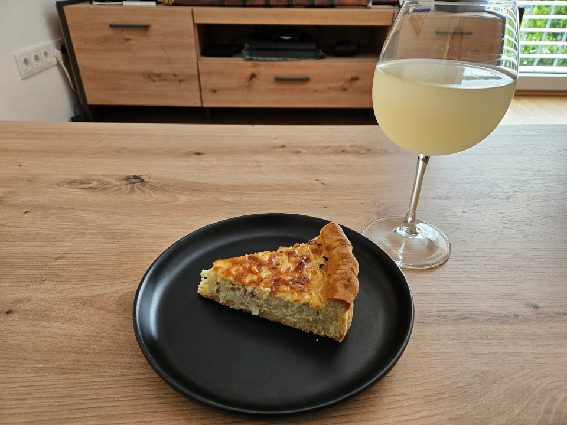
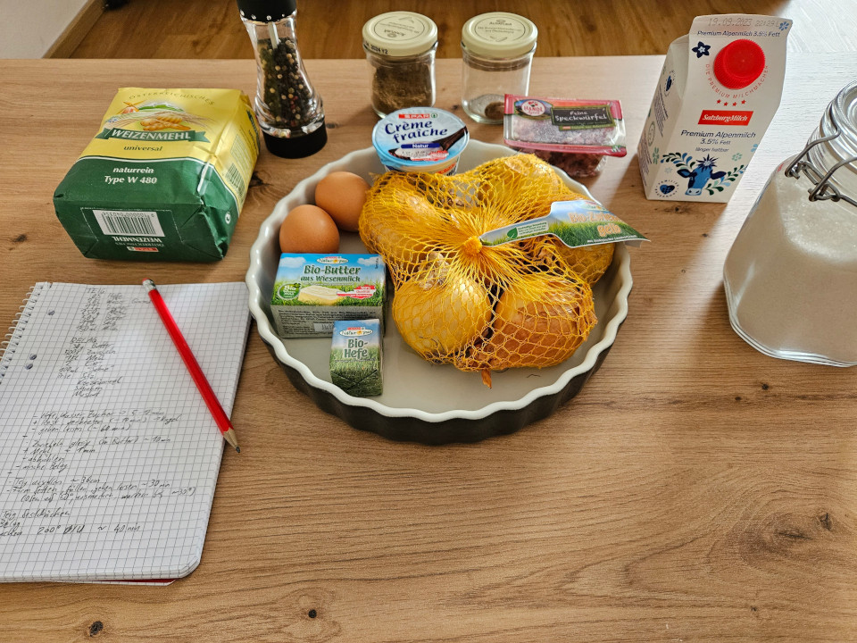

# Schwäbischer Zwiebelkuchen

Perfect for fall, when the age of ice cream is over and the time of Federweißer has come!

## Ingredients
Dough:
- **21g** wet **yeast** (half a block)
- **2 TB** warm **water**
- **1 tsp sugar**
- **250g flour** (~2 cups)
- **50g butter** (~1/3 cup; ~2 oz)
- **1 tsp salt**
- **150ml milk** (bit more than 1/2 cup)

Filling:
- **2 eggs**
- **30g butter** (0.13 cups)
- **500g onions**
- **100ml crème fraîche** (1 small-ish package)
- **bacon bits**
- **salt**
- **cumin**
- **nutmeg**
- **pepper**

## Instructions
Mix the warm water, sugar and yeast and let it do its magic for 10 min.
Aftwards combine all ingredients for the dough in a bowl, mix until you get a smooth dough (should take 10 to 20 min, depending on whether or not you have a machine). Mostly thansk to the butter you should end up with something non-sticky. Form a balla dn let rest for an hour.
Perfect time to cur your half kilo of onions; Personally I dice them, but traditional recipes often call of stripes or rings. Warm some butter in a pan and sweat the onions; You want them glassy, but not browned. Afterwards let them cool down.
Once the dough is rested roll/stretch it out to fill your baking form; Make sure to grease your form and let it proof in an low-heat oven (we are talking sub 50 celsius!) for half an hour. Use that time to combine the filling, making sure the onions are cooled down before adding them.
Get the dough out of the oven and crank up the heat to 200 celsius (non-convection!). Since your dough has probably risen a bit press it down and then pour in the filling, making sure it is relatively even. Once the oven is warm get the onion cake in there and wait for ~40 min (or more . . or less, depending on your oven ¯\\\_(ツ)_/¯).

## Notes
Its best to eat before it fully cooled down - and obviously paired with some Federweißer/Sturm/Sauser/Neuer/young wine.

Honstly, not gonna claim it is some culinary masterpiece, but it is a staple of wine season in the German speaking area.

## Images

